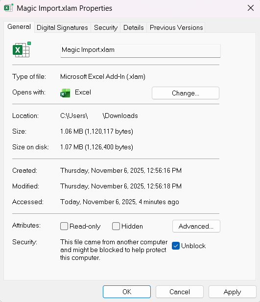
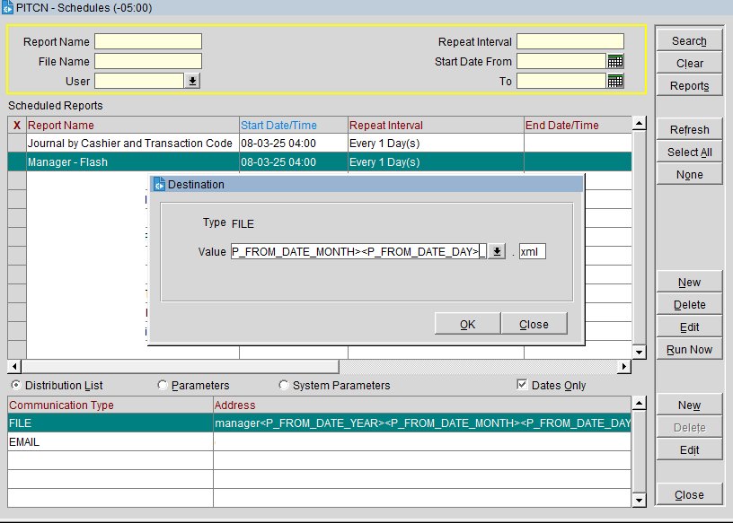

# MAGIC IMPORT

VBA Add-In Macro for Opera PMS Financial Reports excel spreadsheet. Imports manager flash and journal by transaction code reports in .xml format to spreadsheet, selects date row by parsing report name for yyyy/mm/dd, enters data according to transaction code coloumn (sums mc+vs for single column)

---

## Instructions

### Installable Add-In
As an Add-in (.xlam)

- Download .xlam from the "Releases" section of this Repository

- Distribute the .xlam file to users.

---

You may have to "unblock" the .xlam add-in file by right clicking the file in file explorer, Properties > General tab > check "Unblock"



- Users install the add-in to Excel Spreadshet (_saved as .xlsm format_) via File > Options > Add-ins > Go... > browse > select downloaded .xlam file

In "Developer" tab > "Macro Security", enable all macros & trust access to the VBA object model
[_To show the Developer tab in Excel, go to File > Options > Customize Ribbon and check the "Developer" box in the right-hand list of main tabs, then click OK_]

 

### Trust Center Settings:
In Excel, go to File > Options  
Click Trust Center (left sidebar)  
Click Trust Center Settings button  
Go to Protected View (left sidebar)  
Uncheck these options:
- "Enable Protected View for files originating from the Internet"
- "Enable Protected View for files located in potentially unsafe locations"


### Add to Trusted Locations
(the download directory where the .xlam file is located):

File > Options > Trust Center > Trust Center Settings  
Click Trusted Locations  
Click Add new location  
Browse to the folder containing your .xlam file  
Check "Subfolders of this location are also trusted" (if needed)  
Click OK

---

## Naming format for Reports Scheduler

**Manager Flash:**
```
manager<P_FROM_DATE_YEAR><P_FROM_DATE_MONTH><P_FROM_DATE_DAY>_
```

**Journal by Cashier & Transaction Code:**
```
journal<P_FROM_DATE_YEAR><P_FROM_DATE_MONTH><P_FROM_DATE_DAY>_
```

(they both end with ".xml", so ensure the underscore_ is before the ".xml" because that will separate the 8 digit date text from the random generated numerical text that follows and make it more easily readable while still retaining the date in the correct format for the script to parse which row to insert the data. ".xml" is auto-added to the name, outside of the custom text naming field)



## Excel Revenue Spreadsheet Format


